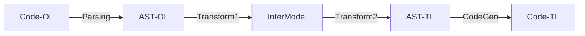

# cob2ex
COBOL to Elixir translator. 
Work In Progress...

<!-- Un comentario -->
### Table of Content
* [Motivation](/cob2ex/motivation)  
* [Technical Analysis](#technical-analysis)  
* [Tools Analysis](#tools-analysis)  
* [Ecosystem](#ecosystem)  
* [General Considerations](#general-considerations)  
* [Miscelanous references](#misc-references)

## Technical Analysis  
Process description:

* **Stage 1: Scanning / Parsing**  
* * Input   : Code in the original language  
* * Process :   
* * * *Scanning* Consumes the plain text of the code file, group together individual characters to form tokens (lexer) 
* * * *Parsing* Consumes tokens and groups them together into complete statements and expression. The Parser is guided by a grammar
* * Output  : AST-OL::AST of the original language  

* **Stage 2: Transformation 1**
* * Input   : AST-OL
* * Process : *Semantic analysis* Traverse the AST-OL and derive additional meaning (semantis) about the program from the rules of the language and the relationship between elements of the program.
* * Output  : Intermediate Model
 
* **Stage 3: Transformation 2**
* * Input   : Intermediate Model 
* * Process : Convert the Intermediate Model (intermediate AST) into an AST of the target language
* * Output  : AST-TL::AST of the target language
 
* **Stage 4: Code generation**
* * Input   : AST-TL
* * Process : Convert the AST of the target language into valid *target language code*
* * Output  : Code in the target language

_Ref_ [How to write a transpiler - F.Tomassetti](https://tomassetti.me/how-to-write-a-transpiler/)

## Tools Analysis  

+ Lexers/Parsers
+ + Lex-Yacc
+ + Flex-Bison
+ + Leex-Yeec
+ ANTLR
+ Xtext

## Ecosystem   
<!-- "" Mainframes are around not just because of COBOL, but because of a whole ecosystem of things like Db2 and CICS. (CICS might be interesting to map to the BEAM model though..) -->

Cobol, RPG, JCL, CICS, DB2  

## General Considerations  
<!-- Introducción a las consideraciones generales. -->

"_COBOL bombs are not a problem because they are written in COBOL; they are a problem because the number of engineers who understand what they are doing well enough to maintain them is shrinking. Transpiling poorly documented, poorly organized COBOL into **Language** (i.e.:Java) just creates poorly documented, poorly organized, atypical Java code. The output of the transpiler is generally loaded with constructs and work arounds that are not intuitive to a good Java developer and may create hidden performance issues._" *M.Bellotti*
_Ref1_: [Defusing COBOL bombs with smart automation](https://medium.com/the-technical-archaeologist/defusing-cobol-bombs-with-smart-automation-9b24f81b5da4)

_Ref2_: [Why COBOL isn’t the problem](https://www.lucidchart.com/techblog/2020/11/13/why-cobol-isnt-the-problem/)  
_Ref3_: [COBOL Isn’t the issue: a misinterpreted crisis](https://hackaday.com/2020/04/20/cobol-isnt-the-issue-a-misinterpreted-crisis/)

## Misc References
[Implementing Domain-Specific Languages with Xtext and Xtend - Lorenzo Bettini](https://www.amazon.com/-/es/Lorenzo-Bettini/dp/1786464969)  

