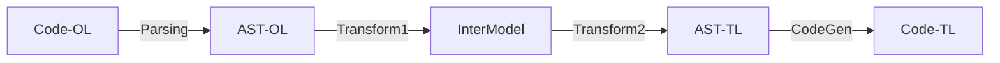

## Technical Analysis  
Process description:

* **Stage 1: Scanning / Parsing**  
* * Input   : Code in the original language  
* * Process :   
* * * *Scanning* Consumes the plain text of the code file, group together individual characters to form tokens (lexer) 
* * * *Parsing* Consumes tokens and groups them together into complete statements and expression. The Parser is guided by a grammar
* * Output  : AST-OL::AST of the original language  

* **Stage 2: Transformation 1**
* * Input   : AST-OL
* * Process : *Semantic analysis* Traverse the AST-OL and derive additional meaning (semantis) about the program from the rules of the language and the relationship between elements of the program.
* * Output  : Intermediate Model
 
* **Stage 3: Transformation 2**
* * Input   : Intermediate Model 
* * Process : Convert the Intermediate Model (intermediate AST) into an AST of the target language
* * Output  : AST-TL::AST of the target language
 
* **Stage 4: Code generation**
* * Input   : AST-TL
* * Process : Convert the AST of the target language into valid *target language code*
* * Output  : Code in the target language

_Ref_ [How to write a transpiler - F.Tomassetti](https://tomassetti.me/how-to-write-a-transpiler/)
